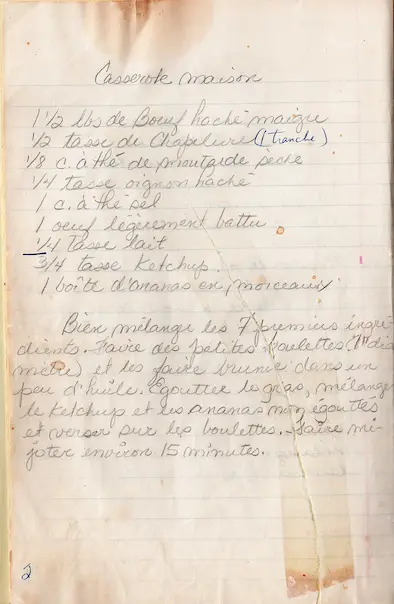

# Casserole Maison  

  

### INGRÉDIENTS  
<pre>
• boeuf haché maigre        1 1/2 lb 
• chapelure (une tranche)     1/2 tasse
• oignons hachés              1/4 tasse 
• oeuf (légèrement battu)   1
• moutarde sèche              1/8 c. à thé 
• lait                        1/4 tasse 
• sel                       1     c. à thé 

étape 2
• ketchup                     3/4 tasse 
• ananas en morceaux        1     boite 
</pre>

  

  

### PRÉPARATION
1. Bien mélanger les 7 premiers ingrédients.  
2. Faire des petites boulettes (1" de diamètre) et les faire brunir dans un peu d'huile.  

étape 2  
1. Egoutter le gras, mélanger le ketchup et les ananas non égouttés.  
2. Verser sur les boulettes et faire mijoter environ 15 minutes.

  

