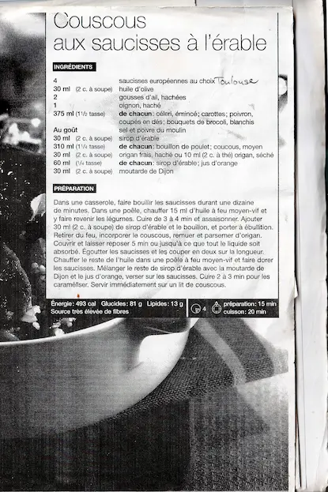

# Couscous aux saucisses à l'érable  

  

### INGRÉDIENTS
<pre>
• saucisses européennes au choix       4
• huile d'olive                       30 ml (2c. à soupe) 
• gousses d'ail hachées                2
• oignon, haché                        1
• céleri émincé, carottes, 
  poivrons coupés en dés, 
  bouquets de brocoli blanchis        375 ml (1 1/2 tasse) de chacun
• sirop d'érable                       30 ml (2c. à soupe)   
• bouillon de poulet: coucous, moyen  310 ml (1 1/4 tasse) de chacun
• sirop d'érable et jus d'orange       60 ml (1/4 tasse) de chacun
• moutarde de Dijon                    3O ml (2c. à soupe)     
• origan frais, haché                  30 ml (2c. à soupe)   
                ou origan séché        10 ml (2 c. à thé) 
• sel et poivre 
</pre>

### PRÉPARATION (15 min.)  — cuisson (20 min.)
1- Dans une casserole, faire bouillir les saucisses durant une dizaine de minutes.  
2- Dans une poêle, chauffer 15 ml d'huile à feu moyen-vif et y faire revenir les légumes.   
3- Cuire de 3 à 4 minutes et assaisonner. 
  
4- Ajouter 30 ml (2 c. à soupe) de sirop d'érable et le bouillon, porter à ébullition.  
5- Retirer du feu, incorporer le couscous et remuer puis parsemer d'origan.  
6- Couvrir et laisser reposer 5 min ou jusqu'à ce que tout le liquide soit absorbé.  
  
7- Égoutter les saucisses et les couper en deux sur la longueur.  
8- Chauffer le reste de l'huile dans une poêle à feu moyen-vif et faire dorer les saucisses. 
  
9- Mélanger le reste de sirop d'érable avec la moutarde de Dijon et le jus d'orange, verser sur les saucisses.  
10- Cuire 2 à 3 min pour les caraméliser. 
   
Servir immédiatement sur un lit de couscous.  

