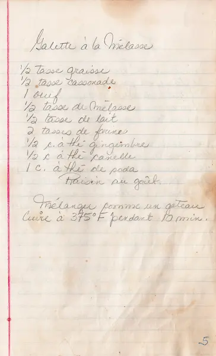

# Galette à la Mélasse

  
  
  

  ### INGRÉDIENTS
  <pre>
  • oeuf         1
  • lait           1/2 tasse 
  • graisse        1/2 tasse
  • mélasse        1/2 tasse
  • cassonade      1/2 tasse
  • farine       2     tasses 
  • soda         1     c. à thé  
  • canelle        1/2 c. à thé
  • gingembre      1/2 c. à thé
  • raisin au goût
  </pre>
  

 
  

  ### PRÉPARATION
  1. Mélanger comme un gâteau.  
  2. Cuire à 375°F pendant 10 min.
    
  Utilisez la vitesse 1 jusqu’à ce que les ingrédients soient mélangés.  
  Puis augmentez progressivement jusqu’à la vitesse souhaitée.  
  Ajoutez toujours les ingrédients le plus près possible du bord du bol et non directement dans le batteur en mouvement.  

> :memo: **Note:** La procédure standard à suivre lorsque vous mélangez la plupart des pâtes, en particulier à gâteau et à biscuits, consiste à ajouter les ingrédients dans l’ordre suivant :
>> 1/3 ingrédients secs avec 1/2 ingrédients liquides, puis  
>> 1/3 ingrédients secs avec le reste des ingrédients liquides, enfin  
>> le reste des ingrédients secs.  

  

[KitchenAid - astuces de melange](https://www.kitchenaid.fr/faq/astuces-de-melange)  

