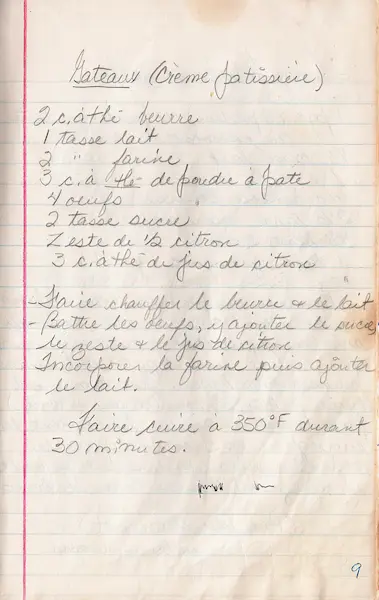

# gâteau crème patissière

  

### INGRÉDIENTS
<pre>
• lait           1    tasse  
• beurre         2    c. à thé   
• oeufs          4
• sucre          2    tasses  
• citron zeste     1/2 
• jus de citron  3    c. à thé  
• poudre à pâte  3    c. à thé  
• farine         2    tasses  
</pre>

  

### PRÉPARATION
1. Faire chauffer le beurre et le lait.  
2. Battre les oeufs, y ajouter le sucre , le zeste et le jus de citron.  
3. Mélanger la farine et la poudre à pâte puis incorporer le lait.  
4. Faire cuire à 350°F durant 30 minutes.

 

  

