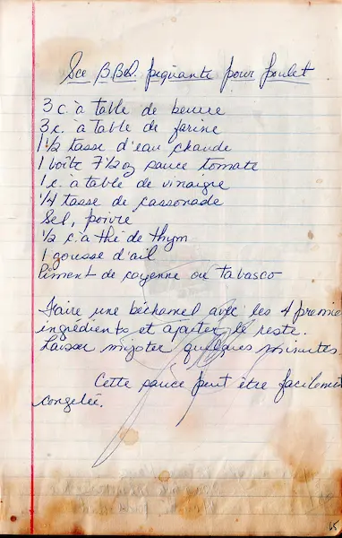

# Sauce BBQ piquante pour poulet  

  

### INGRÉDIENTS
<pre>
• 3 c. à table          de beurre  
• 3 c. à table          de farine  
• 1 1/2 tasse           d'eau chaude  
• 1 boîte (7 1/2 oz)    sauce tomate  
  
• 1 c. à table          de vinaigre  
• 1/4 tasse             de cassonade  
• 1/2 c. à thé          de thym  
• 1                     gousse d'ail  
• piment de cayenne ou tabasco  
• sel et poivre  
</pre>

  

### PRÉPARATION  
  
► Faire une béchamel avec les 4 premiers ingrédients   
► Ajouter le reste des ingrédients  
► Laisser mijoter quelques minutes  
  
::: tip
:bulb:  cette sauce peut être facilement congelée  
:::  

  

