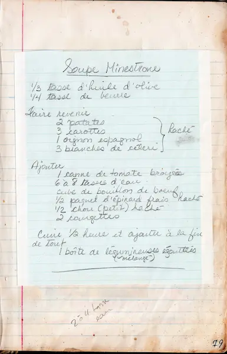

# soupe minestrone  

  

### INGRÉDIENTS  
<pre>
étape 1
• huile d'olive             1/3 tasse  
• beurre                    1/4 tasse  
• patates                 2            
• carottes                3            
• oignon espagnol         1            
• branches de célerie     3  

étape 2  
• courgettes              2         
• tomates broyées             1 canne   
• eau                     6 à 8 tasses  
• bouillon de boeuf           1 cube    
• épinard frais             1/2 paquet  
• chou haché                1/2 petit  

étape 4 
• légumineuses mélangées      1 boîte 
</pre>

  

### PRÉPARATION
1. hacher et faire revenir les légumes    
2. ajouter le reste des ingrédients  
3. cuire 1/2 heure  
4. égoutter les légumineuses et les ajouter à la soupe  

  

