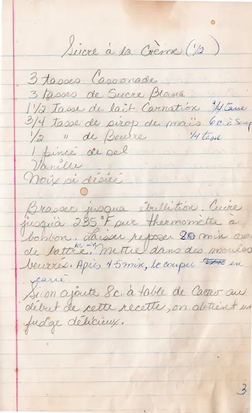

# Sucre à la Crème  

  

### INGRÉDIENTS  
<pre>
• cassonade        3 tasses
• sucre blanc      3 tasses
• lait carnation   1 1/2 ou 3/4 tasse
• sirop de mais      3/4 ou 3/8 tasse
• beurre             1/2 ou 1/4 tasse
• sel              1 pincée
• vanille
• noix  (si desiré)
</pre>

  

### PRÉPARATION  
1. Brasser jusqu'à ébullition.  
2. Chauffer jusqu'a 235°F au thermomètre à bonbon.  
3. Laisser reposer 20 min avant de battre.  
4. Mettre dans des moules beurrés.  
5. Couper en carré après avoir reposé 5 min.  

:memo: 3/8 de tasse = 3 onces = 6 c. à table  

::: tip
Ajouter 8 c. à table de cacao au debut de la recette pour obtenir un fudge delicieux.  
:::  

  

